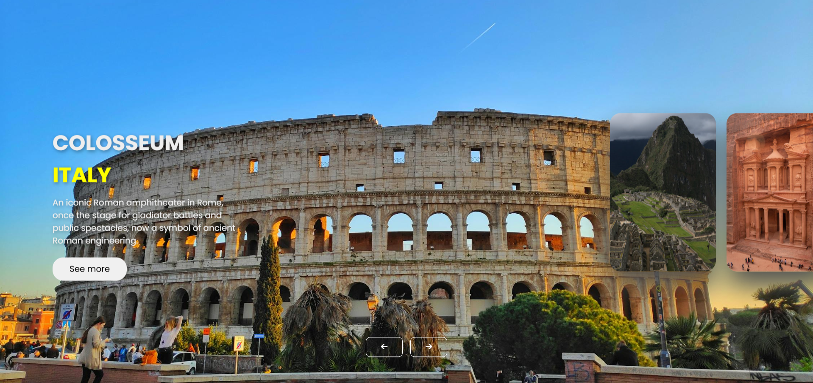

# 7 Wonders of the World 🌏✨  

This project is a website showcasing the **7 Wonders of the World**. It features an **interactive image slider 🎡** that displays pictures, names, and brief descriptions of each wonder, providing an engaging user experience.  

---

## 🚀 Features  

- **🎭 Interactive Image Slider**  
  Users can view **high-quality images 📸** of the wonders along with their names and descriptions. The slider is implemented using JavaScript to provide smooth transitions and user interactivity.  

- **📱 Fully Responsive Design**  
  The website is now **responsive**, ensuring a seamless experience across **mobile 📱, tablet 📊, and desktop 🖥️** devices.  

---

## 🖼️ Screenshots  

    

---

## 🛠️ Technologies Used  

- **🌐 HTML** → Structured the content and layout of the website.  
- **🎨 CSS** → Styled the website, including layout, typography, and responsiveness.  
- **⚡ JavaScript** → Added interactivity, including the image slider and user navigation.  
- **📷 Pexels** → Free images were sourced from [Pexels](https://www.pexels.com) for high-quality visuals.  

---

## 🏆 Wonders Included  

1. 🏯 **The Great Wall of China**  
2. 🏜️ **Petra**  
3. ✝️ **Christ the Redeemer**  
4. ⛰️ **Machu Picchu**  
5. 🏛️ **Chichen Itza**  
6. 🏟️ **Roman Colosseum**  
7. 🕌 **Taj Mahal**  

---

## 🌍 Deployment  

You can view the live project at:  
🔗 [**7 Wonders of the World Website**](https://tonystark-19.github.io/Wonders-of-the-World/)  

---

## 🎖️ Credits  

- 📸 Images sourced from [Pexels](https://www.pexels.com).  
- 🖥️ Designed and developed by **Aditya Chandel**.  
